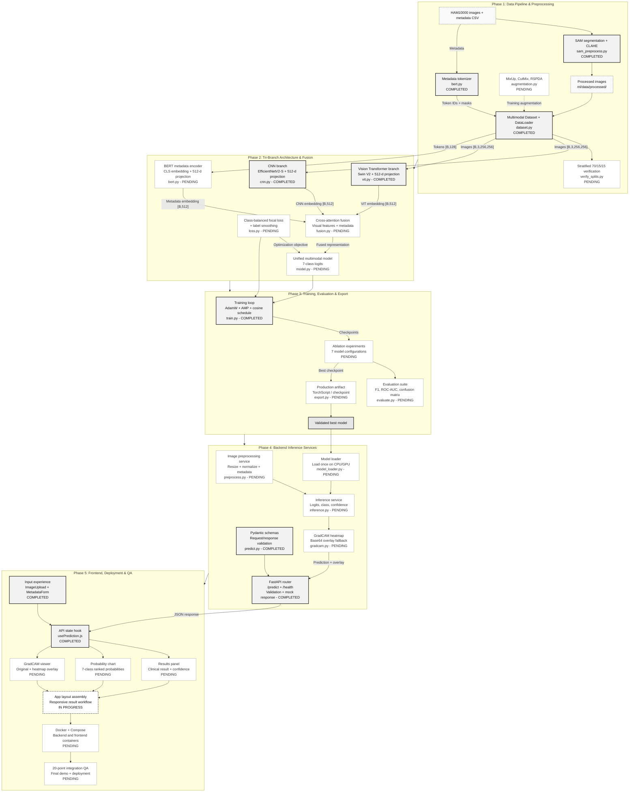

# SkinFuseNet — Comprehensive Remaining Work & Progress Audit

## Executive Summary

This document provides an up-to-date audit of the entire **SkinFuseNet** codebase, synchronizing tasks across the Master Architecture, `PERSON_A_FULLPLAN.md`, `PERSON_B_FULLPLAN.md`, `PERSON_C_FULLPLAN.md`, and all 13 weekly milestone roadmaps (`week1_README.md` through `week13_README.md`).

**Current Assessment Date:** August 29, 2026 (Updated post Person A sprint)  
**Overall Project Completion:** **~45%** (Person A's Week 3–6 sprint completed: SAM preprocessing, Dataset Loader, EfficientNetV2 CNN branch, and Training Loop are all implemented. CLAHE pipeline, BERT tokenizer, and all frontend/backend scaffolding also done. Remaining: ViT, BERT encoder, Fusion, Focal Loss, Model Assembly, Inference Service, GradCAM, and advanced UI components).

---

## 1. Current Codebase Status & Completed Work

### ✅ Confirmed Completed Components

| Area | Component / File | Status & Details |
|---|---|---|
| **Repository Setup** | Root scaffold, environment configs | Base repo, directory hierarchy (`backend`, `frontend`, `ml`, `team`), `.gitignore`, package configs. |
| **Data & Checkpoints** | `ml/checkpoints/sam_vit_b.pth` | SAM ViT-B model weights downloaded (375 MB). |
| **Exploratory ML** | `ml/notebooks/` | Notebooks for PyTorch basics, SAM testing, CLAHE exploration, and class imbalance analysis. |
| **ML Preprocessing** | CLAHE Pipeline | ✅ **Complete (Person B / W3)**: CLAHE logic was successfully merged directly into `sam_preprocess.py`. |
| **ML Tokenization** | BERT Metadata Tokenizer | `ml/src/branches/bert.py` | ✅ **Tokenizer class done** (Person B / W4) |
| **ML Preprocessing** | SAM Lesion Segmentation Script | `ml/src/preprocess/sam_preprocess.py` | ✅ **Completed** (Person A / W3) — GPU-first, fallback + failure log |
| **ML Dataset** | PyTorch Dataset + DataLoader Splits | `ml/src/dataset.py` | ✅ **Completed** (Person A / W4) — multimodal, edge-case handling, stratified 70/15/15 split |
| **ML Testing** | Dataset Verification Script | `ml/tests/verify_dataset.py` | ✅ **Completed** (Person A / W4) |
| **ML CNN Branch** | EfficientNetV2-S Feature Extractor | `ml/src/branches/cnn.py` | ✅ **Completed** (Person A / W5) — d=512 projection + GradCAM hooks |
| **ML Training** | Training Loop (GPU, Mixed Precision) | `ml/src/train.py` | ✅ **Completed** (Person A / W6) — AdamW, CosineAnnealing, Mock model ready to swap |
| **Backend API Scaffold** | `backend/app/main.py` (444 B) | FastAPI application with CORS middleware configured and router mounting. |
| **Backend Routers** | `backend/app/routers/predict.py` (114 lines) | `/health` and `/predict` endpoints, input validation (10MB image limit, JPEG/PNG MIME checks, age [1-120], sex, and 13 valid HAM10000 anatomical localizations), and mock 7-class response. |
| **Backend Schemas** | `backend/app/schemas/predict.py` (706 B) | Pydantic response models: `PredictionResponse` and `HealthResponse`. |
| **Frontend UI (Input)** | `frontend/src/components/ImageUpload.jsx` | Drag-and-drop / file selector, MIME & size checks, image preview. |
| **Frontend UI (Input)** | `frontend/src/components/MetadataForm.jsx` | Age input, sex selector, anatomical site dropdown matching HAM10000 classes. |
| **Frontend UI (Banner)**| `frontend/src/components/DisclaimerBanner.jsx`| Medical research prototype disclaimer banner. |
| **Frontend API Hook** | `frontend/src/hooks/usePrediction.js` (45 lines)| **Complete (Person A/B / W11)**: Async Axios multipart `FormData` submit handler, loading, error, and reset states. |
| **Frontend Application**| `frontend/src/App.jsx` (77 lines) | UI assembly with state management connecting `ImageUpload`, `MetadataForm`, submission button, raw API response view, and reset button. |

---

### ⏳ Confirmed Incomplete / Empty Files

The following files exist in the repository structure but are currently 0-byte placeholders or not yet written:

- `ml/src/preprocess/augmentation.py` (0 bytes)
- `ml/src/fusion.py` (0 bytes)
- `ml/src/loss.py` (0 bytes)
- `ml/src/model.py` (0 bytes)
- `ml/src/evaluate.py` (0 bytes)
- `ml/src/export.py` (0 bytes)
- `ml/src/gradcam.py` (0 bytes)
- `backend/app/core/model_loader.py` (0 bytes)
- `backend/app/services/preprocess.py` (0 bytes)
- `backend/app/services/inference.py` (0 bytes)
- `backend/app/services/image_utils.py` (0 bytes)
- `frontend/src/components/ResultsPanel.jsx` (Not created)
- `frontend/src/components/ProbabilityChart.jsx` (Not created)
- `frontend/src/components/GradCAMViewer.jsx` (Not created)
- `docker-compose.yml` & Dockerfiles (Not created)
- `team/` review reports & ablation results (Only `team/ridam.md` exists)

---

## 2. Area-by-Area Completion & Remaining Work

| Domain | Done | Remaining | Est. Progress |
|---|---|---|---:|
| **ML Data & Preprocessing** | SAM+CLAHE script (`sam_preprocess.py`), SAM checkpoint | `augmentation.py` (MixUp/CutMix/RSPDA), `dataset.py` PyTorch DataLoader, split verification | **30%** |
| **ML Models & Architecture** | BERT Tokenizer class (`bert.py`) | EfficientNetV2 (`cnn.py`), Swin Transformer V2 (`vit.py`), BERT PyTorch module encoder, Cross-Attention Fusion (`fusion.py`), Model assembly (`model.py`), Focal Loss (`loss.py`) | **15%** |
| **Training & Evaluation** | Setup & environment | `train.py` training loop, early stopping, 7 ablation experiments, `evaluate.py` (metrics, per-class report, confusion matrix, ROC-AUC) | **0%** |
| **Model Export & Serving** | Architecture planned | `export.py` (TorchScript / state dict), `model_loader.py`, backend `preprocess.py` service, backend `inference.py` service, backend `gradcam.py` | **0%** |
| **Backend Integration** | FastAPI mock router, validation, schemas | Connect router to real `inference.py` + GradCAM generator, add robust runtime exception handling | **45%** |
| **Frontend Experience** | Form controls, input validation, Axios hook, App container | Dedicated `ResultsPanel.jsx`, interactive `ProbabilityChart.jsx`, heatmap overlay `GradCAMViewer.jsx`, loading skeletons | **55%** |
| **Deployment & Ops** | Local dev scripts | `Dockerfile` (frontend/backend), `docker-compose.yml`, staging/cloud deployment setup | **0%** |
| **Team Documentation** | Week 1-2 summaries, full plans | `API_CONTRACT.md`, weekly review logs (W3–W13), ablation logs, integration test reports, final demo video | **25%** |

---

## 3. Person-by-Person Remaining Work Breakdown

### 👤 Person A — Data Pipeline, CNN, Training Loop & Router Integration

*Primary Layers:* SAM Segmentation → Dataset Loader → EfficientNetV2 → Training Orchestration → Backend Router Integration → Full Integration QA

#### Remaining Tasks:
1. **Week 3 (Data Preprocessing):**
   - [x] ~~Implement `ml/src/preprocess/sam_preprocess.py` using `ml/checkpoints/sam_vit_b.pth`.~~
   - [ ] **ACTION NEEDED**: Run `sam_preprocess.py` on the full HAM10000 dataset. Coordinate output format with Person B.
2. **Week 4 (Dataset Loading):**
   - [x] ~~Implement `ml/src/dataset.py` with multi-modal inputs.~~
   - [x] ~~Handle edge cases: missing ages, unknown localization/sex, corrupt images.~~
   - [x] ~~Write `ml/tests/verify_dataset.py` to validate tensor shapes, batch dtypes, and value normalization.~~
   - [ ] **ACTION NEEDED**: Download HAM10000 metadata CSV → place at `ml/data/raw/HAM10000_metadata.csv`.
3. **Week 5 (CNN Branch):**
   - [x] ~~Implement `ml/src/branches/cnn.py` using EfficientNetV2-S.~~
   - [x] ~~Project feature output to shared embedding dimension ($d=512$).~~
   - [x] ~~Define GradCAM hooks on `conv_head`.~~
4. **Week 6 (Training Loop):**
   - [x] ~~Implement `ml/src/train.py` with mixed precision, AdamW, CosineAnnealing, checkpoint saving.~~
   - [ ] **ACTION NEEDED**: Once Person C finishes `model.py` and `loss.py`, swap `MockSkinFuseNetModel` → `SkinFuseNetModel` and `CrossEntropyLoss` → `FocalLoss` in `train.py`.
   - [ ] Log step/epoch metrics (Loss, Accuracy, Macro F1).
5. **Week 7 (Ablation Experiments):**
   - [ ] Orchestrate the 7 ablation training runs (CNN-only, ViT-only, CNN+ViT, Vision+Metadata, Cross-Attention vs Concatenation, etc.).
   - [ ] Record results in `team/ablation_results.md` and select the best checkpoint.
6. **Week 8 (Backend Router):**
   - [ ] Update `backend/app/routers/predict.py` to replace mock response with real `inference.py` service.
   - [ ] Maintain strict validation and error handling for inference failures.
7. **Week 10-12 (Frontend Polish & QA):**
   - [ ] Polish `ImageUpload.jsx` (accessibility, mobile responsiveness, drag drop feedback).
   - [ ] Lead execution of the 20-point end-to-end integration test checklist (`team/integration_checklist.md`).
8. **Week 13 (Documentation & Demo):**
   - [ ] Update root `README.md` with final architecture diagrams, reproduction commands, and measured benchmarks.

---

### 👤 Person B — CLAHE, BERT Tokenizer, Swin ViT, Fusion, Evaluation & Inference Service

*Primary Layers:* CLAHE → BERT Tokenization → Swin Transformer V2 → Cross-Attention Fusion → Evaluation & GradCAM → Backend Inference Service → Results UI

#### Remaining Tasks:
1. **Week 3 (CLAHE):**
   - [x] CLAHE contrast enhancement logic was successfully merged into Person A's `sam_preprocess.py` script. (**Done**)
   - [ ] Validate the combined SAM+CLAHE output across the full dataset.
2. **Week 4 (BERT Tokenization):**
   - [x] Implement `ml/src/branches/bert.py` `MetadataTokenizer` class (**Done**).
   - [ ] Test tokenization batching and attention masks with `dataset.py`.
3. **Week 5 (Vision Transformer Branch):**
   - [x] Implement `ml/src/branches/vit.py` using Swin Transformer V2 (`swin_v2_b` or `swin_v2_t`). (**Done**)
   - [x] Project token embedding output to shared dimension ($d=512$). (**Done**)
4. **Week 6 (Cross-Attention Fusion):**
   - [ ] Implement `ml/src/fusion.py` Cross-Attention module (Visual tokens query Metadata, or bidirectional cross-attention).
   - [ ] Add projection head and layer normalization before final classification layer.
5. **Week 7 (Evaluation):**
   - [ ] Implement `ml/src/evaluate.py` to compute accuracy, balanced accuracy, precision, recall, macro F1, per-class metrics, confusion matrix, and ROC-AUC curves.
   - [ ] Generate evaluation plots and output `team/final_results.md`.
6. **Week 8 (Inference Service):**
   - [ ] Implement `backend/app/services/inference.py`: load model once at startup into memory/GPU, execute inference in `eval` mode with `torch.no_grad()`.
   - [ ] Return sorted probabilities, predicted class name, confidence, and metadata description.
7. **Week 9 (GradCAM Heatmaps):**
   - [ ] Implement `ml/src/gradcam.py` (and backend integration) to compute activation heatmaps from EfficientNetV2's final convolutional layer.
   - [ ] Convert overlay image to base64 PNG string for API transmission with a reliable fallback on failure.
8. **Week 10-11 (Frontend Results Component):**
   - [ ] Build `frontend/src/components/ResultsPanel.jsx` with clinical descriptions, diagnostic badges, severity markers, and medical disclaimer.
   - [ ] Refactor `App.jsx` to render `ResultsPanel` cleanly instead of the raw JSON debug block.
9. **Week 12-13 (Deployment & Bug Fixing):**
   - [ ] Fix end-to-end bugs discovered during integration testing.
   - [ ] Configure cloud/container deployment and verify live inference.

---

### 👤 Person C — Augmentations, Split Verification, BERT Module, Focal Loss, Model Assembly, Export & Charts

*Primary Layers:* Data Augmentations → Stratified Splitting → BERT Network Encoder → Focal Loss → Model Assembly → TorchScript Export → Preprocessing Service → Visual Charts & Docker

#### Remaining Tasks:
1. **Week 3 (Data Augmentation Pipeline):**
   - [ ] Implement `ml/src/preprocess/augmentation.py` with MixUp, CutMix, and dermoscopy-tailored RSPDA (Rotated & Shifted Patch Data Augmentation).
   - [ ] Test augmentations on sample images and verify label mixing mathematics.
2. **Week 4 (Stratified Split Verification):**
   - [ ] Create split verification script (`ml/tests/verify_splits.py`) to enforce stratified 70/15/15 train/val/test split across all 7 classes.
   - [ ] Log class distribution and minority class support counts in `team/split_verification_results.md`.
3. **Week 5 (BERT Encoder Network):**
   - [ ] Implement PyTorch neural network module in `ml/src/branches/bert.py` wrapping HuggingFace `BertModel` (or `ClinicalBERT`).
   - [ ] Extract `[CLS]` token representation and project to shared embedding dimension ($d=512$) with freezing/unfreezing strategy.
4. **Week 6 (Loss & Model Assembly):**
   - [ ] Implement `ml/src/loss.py` with Class-Balanced Multi-Class Focal Loss and Label Smoothing.
   - [ ] Implement `ml/src/model.py` (`SkinFuseNetModel`) combining CNN, ViT, BERT, and Cross-Attention Fusion into a unified forward pass returning 7 logits.
   - [ ] Validate gradient backpropagation through all branches.
5. **Week 7 (Model Export):**
   - [ ] Implement `ml/src/export.py` to save production checkpoint / TorchScript artifact into `backend/models/`.
   - [ ] Write `team/model_export_guide.md` detailing weights loading and signature verification.
6. **Week 8 (Backend Preprocessing Service):**
   - [ ] Implement `backend/app/services/preprocess.py` to convert raw image bytes and JSON metadata into exact model input tensors `[1, 3, 256, 256]` with ImageNet normalization.
   - [ ] Implement `backend/app/core/model_loader.py` for singleton model loading.
7. **Week 9 (Schemas & Validation):**
   - [ ] Enhance `backend/app/schemas/predict.py` with comprehensive Field descriptions, Pydantic validators for probability sums, and OpenAPI examples.
8. **Week 10-11 (Visual Frontend Components):**
   - [ ] Implement `frontend/src/components/ProbabilityChart.jsx` displaying animated bars for all 7 lesion classes sorted by confidence.
   - [ ] Implement `frontend/src/components/GradCAMViewer.jsx` featuring side-by-side original image vs GradCAM heatmap overlay with transparency slider.
   - [ ] Assemble full responsive layout in `frontend/src/App.jsx`.
9. **Week 12-13 (Docker & Demo Video):**
   - [ ] Create `Dockerfile` for backend, `Dockerfile` for frontend, and root `docker-compose.yml`.
   - [ ] Record end-to-end product demo video demonstrating real lesion classification and GradCAM visualization.

---

## 4. Weekly Milestone Roadmap Summary

| Week | Phase / Milestone | Status | Key Deliverables Remaining |
|:---:|---|:---:|---|
| **W1** | Project Setup & HAM10000 Exploration | ✅ **100%** | Environment, dependencies, dataset exploration |
| **W2** | Scaffolding, Fast Prototypes & Mocks | ✅ **100%** | Mock FastAPI, React forms, notebook validations |
| **W3** | Production Preprocessing Pipelines | ⏳ **35%** | `sam_preprocess.py` (with CLAHE merged) ✅; Need `augmentation.py` |
| **W4** | Dataset Finalisation & Tokenization | ⏳ **35%** | BERT Tokenizer ✅; Need `dataset.py` & Split Verification |
| **W5** | Three Feature Extraction Branches | ⏳ **0%** | EfficientNetV2 (`cnn.py`), Swin (`vit.py`), BERT Module (`bert.py`) |
| **W6** | Cross-Attention Fusion & Model Assembly | ⏳ **0%** | `fusion.py`, `loss.py`, `model.py`, `train.py` |
| **W7** | Training, Ablation Study & Export | ⏳ **0%** | 7 ablation runs, `evaluate.py`, `export.py` |
| **W8** | Real Backend Inference & Preprocessing | ⏳ **20%** | Mock router exists; Need `inference.py`, `preprocess.py`, `model_loader.py` |
| **W9** | GradCAM Backend & API Schema Hardening | ⏳ **25%** | Base schemas exist; Need `gradcam.py` & overlay generation |
| **W10**| Frontend Results & Visualization UI | ⏳ **40%** | Forms exist; Need `ResultsPanel.jsx`, `ProbabilityChart.jsx`, `GradCAMViewer.jsx` |
| **W11**| Frontend-Backend Full Wire-Up | ⏳ **70%** | `usePrediction.js` hook & submit wired; Need component UI polishing |
| **W12**| End-to-End Integration & Docker | ⏳ **0%** | Integration test suite, Dockerfiles, `docker-compose.yml` |
| **W13**| Final Documentation, Demo & Deployment | ⏳ **10%** | Live deployment, final demo recording, README benchmark update |

---

## 5. Critical Path & Immediate Next Sprint

To make rapid, unblocked progress, team members should execute tasks in the following strict dependency sequence:

### Action Items for Today:
1. **Person A:** You have completed `sam_preprocess.py`, `dataset.py`, `cnn.py`, and `train.py`. Next, run `sam_preprocess.py` on the full HAM10000 dataset, download the metadata CSV, and wait for Person C to finish `loss.py` and `model.py` so you can swap them into your training loop. Then orchestrate the 7 ablation training runs (Week 7).
2. **Person B:** Your Week 3 CLAHE task was successfully merged into Person A's `sam_preprocess.py`. Validate the combined output, then proceed with Week 6 Cross-Attention `fusion.py`.
3. **Person C:** Complete `ml/src/preprocess/augmentation.py`, write `ml/tests/verify_splits.py`, implement the PyTorch module in `ml/src/branches/bert.py`, and draft `ml/src/loss.py` (Focal Loss) and `ml/src/model.py`.
